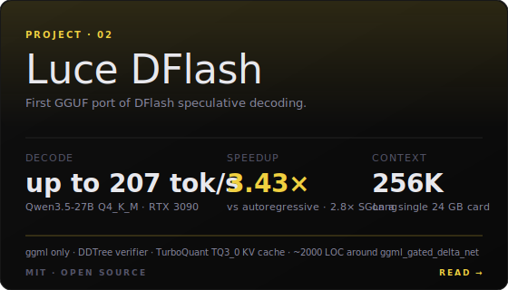
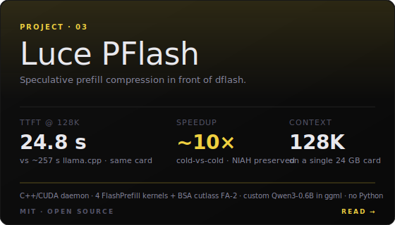

<p align="center">
  
</p>

<p align="center">
  <a href="https://lucebox.com"></a>
  <a href="https://discord.gg/yHfswqZmJQ"></a>
  <a href="https://lucebox.com/blog"></a>
</p>

<p align="center">
  <a href="LICENSE"></a>
  <a href="https://developer.nvidia.com/cuda-toolkit"></a>
  <a href="https://isocpp.org"></a>
</p>

<p align="center">
  <strong>Open LLM inference, rewritten by hand for one specific chip at a time.</strong><br/>
  Kernels, speculative decoding, and quantization, tailored per target.<br/>
  We don't wait for better silicon. We rewrite the software.
</p>

---

## Inside the box

Three projects today, more coming. Each one is a self-contained release with its own benchmarks and paper-style writeup.

<p align="center">
  <a href="megakernel/"></a>
  &nbsp;&nbsp;
  <a href="dflash/"></a>
</p>

<p align="center">
  <a href="pflash/"></a>
</p>

---

## 01 · Megakernel Qwen3.5 0.8B on RTX 3090

**The first megakernel for hybrid DeltaNet/Attention LLMs.** All 24 layers of Qwen 3.5-0.8B in a single CUDA dispatch, 1.87 tok/J on a 2020 GPU, matching Apple's latest silicon at 2× the throughput.

```bash
# 1. clone + enter
git clone https://github.com/Luce-Org/lucebox-hub && cd lucebox-hub/megakernel

# 2. install (Python 3.10+, CUDA 12+, PyTorch 2.0+). Weights stream from HF on first run.
python -m venv .venv && source .venv/bin/activate   # required on Ubuntu 24+ system Python (PEP 668)
pip install --upgrade pip
pip install torch                          # install BEFORE the next step; setup.py imports torch at build time
pip install -e . --no-build-isolation      # --no-build-isolation lets the build see the torch you just installed

# 3. run the benchmark (prefill pp520 + decode tg128 vs llama.cpp BF16 + PyTorch HF)
python final_bench.py
```

| Method | Prefill pp520 | Decode tg128 | tok/J |
|--------|:-------------:|:------------:|:-----:|
| **Megakernel** `@220W` | **21,347** | **413** | **1.87** |
| llama.cpp BF16 `@350W` | 11,247 | 267 | 0.76 |
| PyTorch HF | 7,578 | 108 | n/a |

**What makes it work:** 82 blocks, 512 threads, one persistent kernel. No CPU round-trips between layers. Weights streamed straight from HuggingFace. Cooperative grid sync instead of ~100 kernel launches per token. Power ceiling hit before compute ceiling, so DVFS converts tight execution straight into saved watts.

[Full writeup →](megakernel/README.md) · [Benchmarks →](megakernel/RESULTS.md) · [Blog post →](https://lucebox.com/blog/megakernel)

> **Blackwell (RTX 5090, DGX Spark / GB10):** auto-detected by setup; NVFP4 decode path lands ~194 tok/s tg128 on GB10. See [megakernel/README.md#blackwell-sm_120--sm_121a](megakernel/README.md).

---

## 02 · DFlash DDtree Qwen3.5 27B GGUF on RTX 3090

**First GGUF port of DFlash speculative decoding.** Qwen3.5-27B on a single RTX 3090, Q4_K_M target + BF16 draft, DDTree budget=22.

- **Up to 207 tok/s** in the demo (207.6 tok/s DFlash vs 38.0 tok/s AR, 5.46×)
- **129.5 tok/s mean** on the HumanEval 10-prompt bench
- **3.43× faster than autoregressive** (+15% over chain speculative decoding)
- **2.8× faster than SGLang AWQ** on the same hardware
- **Up to 256K context in 24 GB** via TurboQuant TQ3_0 KV cache (128K Q4_0 bench: 134.78 tok/s at ctx=131072)

```bash
# 1. clone with submodules (pulls the pinned Luce-Org/llama.cpp@luce-dflash fork)
git clone --recurse-submodules https://github.com/Luce-Org/lucebox-hub && cd lucebox-hub/dflash

# 2. build the C++/CUDA decoder (CUDA 12+, CMake 3.18+)
# Default compiles for 75/80/86/89 (+120 on CUDA 12.8+, +sm_121/DGX Spark on CUDA 12.9+, +sm_110/Thor on CUDA 13.0+) so the binary runs on every supported card.
# 3090-only users can add -DCMAKE_CUDA_ARCHITECTURES=86 to skip the other archs and build faster (~3 min).
cmake -B build -S . -DCMAKE_BUILD_TYPE=Release
cmake --build build --target test_dflash -j

# 3. fetch weights: ~16 GB Q4_K_M target + 3.46 GB bf16 draft
huggingface-cli download unsloth/Qwen3.5-27B-GGUF Qwen3.5-27B-Q4_K_M.gguf --local-dir models/
huggingface-cli download z-lab/Qwen3.5-27B-DFlash model.safetensors --local-dir models/draft/

# 4a. one-shot streaming generate
python3 scripts/run.py --prompt "def fibonacci(n):"

# 4b. or reproduce the paper-style bench (HumanEval + GSM8K + Math500, ~15 min)
python3 scripts/bench_llm.py
```

| Benchmark | AR (tok/s) | DFlash+DDTree (tok/s) | Speedup |
|-----------|:----------:|:---------------------:|:-------:|
| **HumanEval** | 37.8 | **129.5** | **3.43×** |
| Math500 | 37.7 | 110.5 | 2.93× |
| GSM8K | 37.7 | 96.2 | 2.55× |

**The constraint that shaped the project.** AWQ INT4 of Qwen3.5-27B plus the BF16 draft doesn't leave room for the DDTree verify state on a 24 GB card. Q4_K_M GGUF (~16 GB target) is the largest format that fits target + 3.46 GB draft + budget=22 tree state + KV cache in 24 GB on the RTX 3090. Picking it forced a new port on top of ggml, since no public DFlash runtime supports a GGUF target.

**What we built vs what we didn't.** The algorithms are not ours:
- [**DFlash**](https://arxiv.org/abs/2602.06036) (z-lab, 2026): block-diffusion draft conditioned on target hidden states.
- [**DDTree**](https://arxiv.org/abs/2604.12989) (Ringel et al., 2026): tree-structured verify that beats chain verify at the same compute budget.

What we ported and tuned:
- C++/CUDA decode engine on top of ggml (no libllama, no Python runtime, Q4_K_M target path).
- Three custom CUDA kernels for tree-aware SSM state rollback: `ggml_ssm_conv_tree`, `ggml_gated_delta_net_tree`, `ggml_gated_delta_net_tree_persist`.
- DDTree budget swept for RTX 3090 + Q4_K_M target: **budget=22** is the sweet spot.
- TQ3_0 KV cache (TurboQuant 3.5 bpv, default) + sliding `target_feat` ring to fit up to 256K context in 24 GB (Q4_0 available as legacy, tops out near 128K).

### Running on other GPUs (4090, 5090, DGX Spark / GB10, Jetson AGX Thor)

Supported out of the box; the build just needs the right CUDA toolkit. `dflash/CMakeLists.txt` already auto-adds Blackwell archs when your nvcc is new enough, so the main quickstart above works as-is on newer cards.

| GPU | Arch | Min CUDA | Status |
|-----|:----:|:--------:|--------|
| RTX 3090 Ampere | `sm_86` | 12.0 | **reference, all numbers above** |
| RTX 2080 Ti Turing | `sm_75` | 12.0 | supported, 53 tok/s DFlash verified (FP16 draft) |
| RTX 4090 Ada | `sm_89` | 12.0 | should work, unverified, pass `-DCMAKE_CUDA_ARCHITECTURES=89` |
| RTX 5090 Blackwell consumer | `sm_120` | 12.8 | supported, auto-added by CMake |
| DGX Spark / GB10 | `sm_121` (compute capability 12.1) | 12.9 | supported, auto-added by CMake |
| Jetson AGX Thor | `sm_110` | 13.0 | supported, auto-added by CMake |

Verify your target:
```bash
python -c "import torch; p=torch.cuda.get_device_properties(0); print(p.name, 'sm_%d%d'%(p.major,p.minor), p.multi_processor_count,'SMs', round(p.total_memory/1e9,1),'GB')"
nvcc --version
```

**DGX Spark / GB10 quick start:**
```bash
# CUDA 12.9+ required for sm_121
nvcc --version  # must show >= 12.9
git clone --recurse-submodules https://github.com/Luce-Org/lucebox-hub && cd lucebox-hub/dflash
cmake -B build -S . -DCMAKE_BUILD_TYPE=Release   # CMake auto-adds sm_121
cmake --build build --target test_dflash -j
```

**Jetson AGX Thor quick start:**
```bash
# CUDA 13.0+ required for sm_110 / AGX Thor.
nvcc --version
git clone --recurse-submodules https://github.com/Luce-Org/lucebox-hub && cd lucebox-hub/dflash
cmake -B build -S . -DCMAKE_BUILD_TYPE=Release   # CMake auto-adds the Thor arch your nvcc supports
cmake --build build --target test_dflash -j
```

**What will NOT auto-port:**
- **DDTree `budget=22`** tuned for 3090 + Q4_K_M + 24 GB. On cards with more VRAM (5090 32 GB, GB10 128 GB unified), re-sweep, larger tree = more verify throughput until memory bandwidth saturates. `scripts/bench_llm.py` has the sweep hooks.
- **TQ3_0 KV cache + sliding `target_feat` ring** was shaped by 24 GB (fits up to 256K context on a 3090). On GB10 (128 GB unified) / 5090 (32 GB) you can push context further or skip quantization entirely and keep F16 KV.
- **Perf numbers** (207 tok/s demo, 129.5 HumanEval, 2.8× vs SGLang AWQ) are RTX 3090 @ stock. Blackwell/Ada not yet swept, PRs with `RESULTS.md` entries welcome.

[Full writeup →](dflash/README.md) · [Benchmarks →](dflash/RESULTS.md) · [Blog post →](https://lucebox.com/blog/dflash27b)

> **Qwen3.6-27B (supported, experimental draft):** same `qwen35` architecture, so the 3.6 Q4_K_M GGUF loads as a drop-in target. With z-lab's matched [Qwen3.6-27B-DFlash](https://huggingface.co/z-lab/Qwen3.6-27B-DFlash) draft (still under training, 2026-04-26 snapshot), HumanEval lands at ~78 tok/s (AL 5.05); the 3.5 draft gets ~74 tok/s. 3.5↔3.5 reference is 129.5 tok/s. AL should improve as z-lab finishes training the draft. Details in [dflash/README.md](dflash/README.md#qwen36-27b-target-experimental).

---

## 03 · PFlash speculative prefill on RTX 3090

**In-process speculative prefill, C++/CUDA only.** A drafter (Qwen3-0.6B BF16) loaded directly into the dflash daemon scores per-token importance over a long prompt; the heavy target (Qwen3.6-27B Q4_K_M) only prefills the spans that matter. Both models share the same ggml allocator on a single RTX 3090. **No Python, no Triton, no PyTorch at runtime** — just the dflash binary and four custom CUDA kernels (`mean_K → score → select → sparse_fwd`) plus BSA ([mit-han-lab/Block-Sparse-Attention](https://github.com/mit-han-lab/Block-Sparse-Attention), FA-2 derived, sm_80+) for the long-context drafter forward.

- **~10.4× TTFT** on 128K context: **24.8 s** dflash daemon vs **~257 s** llama.cpp (FA on, Q4_0 KV).
- **10.0× TTFT** on 64K context: **13.5 s** dflash vs **134.95 s** llama.cpp.
- **NIAH single-needle retrieved** at every measured context (32K → 128K), `keep_ratio=0.05`, `DFLASH_FP_ALPHA=0.85`.

```bash
# 1. build dflash + BSA kernel (sm_80+ required for BSA, ~10 min cold compile)
git clone --recurse-submodules https://github.com/Luce-Org/lucebox-hub && cd lucebox-hub/dflash
cmake -B build -S . -DCMAKE_BUILD_TYPE=Release \
                    -DCMAKE_CUDA_ARCHITECTURES=86 \
                    -DDFLASH27B_ENABLE_BSA=ON
cmake --build build --target test_dflash test_flashprefill_kernels -j

# 2. fetch weights: 27B Q4_K_M target + 0.6B BF16 drafter (GGUF) + DFlash spec-decode draft
huggingface-cli download unsloth/Qwen3.6-27B-GGUF Qwen3.6-27B-Q4_K_M.gguf --local-dir models/
huggingface-cli download unsloth/Qwen3-0.6B-GGUF Qwen3-0.6B-BF16.gguf --local-dir models/
huggingface-cli download z-lab/Qwen3.5-27B-DFlash model.safetensors --local-dir models/draft/

# 3. run the daemon: compress (drafter scoring) + generate (target spec decode)
DFLASH_FP_USE_BSA=1 DFLASH_FP_ALPHA=0.85 \
./build/test_dflash models/Qwen3.6-27B-Q4_K_M.gguf models/draft/model.safetensors --daemon
# stdin protocol: `compress <ids.bin> <keep_x1000> <drafter.gguf>` →
#                 stream of compressed token ids, then `generate <…>` →
#                 stream of generated tokens.
```

| Source S | dflash TTFT | llama.cpp baseline | Speedup | NIAH |
|----------|:-----------:|:------------------:|:-------:|:----:|
| **64K**  | **13.5 s** | 134.95 s (FA off, dense) | **10.0×** | ✅ |
| **128K** | **24.8 s** | ~257 s (FA on, Q4_0 KV)  | **~10.4×** | ✅ |

Daemon stdin commands: `compress` runs the drafter with FlashPrefill block-sparse attention and returns the compressed token-id stream; `generate` runs the target on that stream with normal speculative decode + DDTree. `park` / `unpark` / `free drafter` swap weights in and out of VRAM so target + drafter coexist on a 24 GB card.

**Runtime tunables** (full list in [`dflash/src/flashprefill.h`](dflash/src/flashprefill.h)):
```
DFLASH_FP_USE_BSA=1     # dispatch sparse FA forward through BSA (sm_80+)
DFLASH_FP_ALPHA=0.85    # block-selection threshold; higher = stricter = fewer K-blocks per Q-row
DFLASH_FP_PROFILE=1     # log mean / score / select / forward stage timings
```

**What's ours, what isn't.** Algorithms are from [Cross-Family Speculative Prefill (Liu et al., ICLR 2026)](https://arxiv.org/abs/2603.02631) for the scoring + selection layer and [FlashPrefill (Fan et al., 2026)](https://arxiv.org/abs/2603.06199) for the drafter sparse-attention forward. What we built:
- C++/CUDA daemon-resident speculative prefill in front of a quantized GGUF target — no PyTorch, no Triton, no per-request subprocess.
- BSA wired without `libtorch` via a 3-header ATen/c10 stub set under `dflash/deps/bsa_stubs/`.
- Custom Qwen3-0.6B forward (`qwen3_0p6b_*`) so the drafter runs through the same ggml allocator as the 27B target.
- 4 CUDA kernels (`flashprefill_kernels.cu`) for the FlashPrefill `mean_K / score / select / sparse_fwd` algorithm.

[Full writeup →](pflash/README.md) · [Daemon-side build / tunables →](dflash/docs/SPEC_PREFILL.md) · [Blog post →](https://lucebox.com/blog/pflash)

---

## Why this exists

Local AI should be a default, not a privilege: private data, no per-token bill, no vendor lock-in. The hardware to run capable models already sits on desks. The software to run those chips well doesn't.

General-purpose frameworks dominated the last decade because hand-tuning kernels per chip was too expensive to justify. One stack, decent on everything, great on nothing. Most of the silicon's capability stays on the floor.

AI-assisted development flips that calculus. Rewrites that took a quarter now fit in a release cycle. Lucebox is where we publish them, one chip and one model family at a time. MIT source, full writeup, reproducible benchmarks.

---

## Requirements

All experiments in this repo are built, tuned, and benchmarked on NVIDIA RTX 3090 (2020), the reference target. Supported GPU families:

- **Ampere** (sm_86, RTX 3090 / A-series): reference, CUDA 12+.
- **Ada** (sm_89, RTX 40xx): should work, unverified, CUDA 12+.
- **Blackwell consumer** (sm_120, RTX 50xx incl. 5090): supported, CUDA 12.8+.
- **DGX Spark / GB10** (sm_121, compute capability 12.1): supported, CUDA 12.9+.
- **Jetson AGX Thor** (sm_110): supported, CUDA 13+.
- **Turing** (sm_75, RTX 2080): supported, CUDA 12+.

PyTorch 2.0+. `dflash/` needs CMake 3.18+ and `--recurse-submodules` for the pinned `Luce-Org/llama.cpp@luce-dflash` fork (three tree-mode ggml ops); multi-arch build is automatic (see [Running on other GPUs](#running-on-other-gpus-4090-5090-dgx-spark--gb10-jetson-agx-thor)).

**Megakernel porting note.** `megakernel/setup.py` auto-detects the GPU arch and SM count at build time via `torch.cuda.get_device_capability()`. The decode grid is persistent (one block per SM) and is clamped to the resident-block ceiling at runtime, so no manual tuning is needed. On SM < 80 (Turing), the kernel uses FP16 instead of BF16 via a compile-time `TARGET_SM` flag; on SM ≥ 80 (Ampere+), BF16 is used. Just `pip install -e . --no-build-isolation` and the right code path is selected automatically.

**Optional, find your GPU's sweet spot:** `sudo nvidia-smi -pl 220` (megakernel hits best tok/J at 220 W on 3090; re-sweep for other cards).

---

## Repository layout

```
lucebox-hub/
├── megakernel/    · fused forward pass for Qwen 3.5-0.8B
├── dflash/        · DFlash speculative decoding port for Qwen 3.5/3.6-27B on RTX 3090
├── pflash/        · speculative-prefill harness in front of dflash (12.5× TTFT at 128K)
└── assets/        · banners, cards, diagrams
```

---

## Roadmap

```
  Q1 2026    ▮▮▮▮▮▮▮▮▮▮    RTX 3090 kernels & optimizations
  Q2 2026    ▮▮▮▮▮▯▯▯▯▯    Ryzen AI MAX+ 395 optimizations
  Q2 2026    ▮▮▯▯▯▯▯▯▯▯    Heterogeneous CPU + GPU latency optimizations
  Q2 2026    ▮▯▯▯▯▯▯▯▯▯    Lucebox OS for local AI machines
  Q3 2026    ▯▯▯▯▯▯▯▯▯▯    Lucebox official launch
```

---

## Citation

```bibtex
@software{lucebox_2026,
  title  = {Lucebox: Open LLM Inference, Rewritten by Hand for One Specific Chip at a Time},
  author = {Lucebox},
  url    = {https://github.com/Luce-Org/lucebox-hub},
  year   = {2026}
}
```

Per-project citations live in each subproject's README.

---

## Inspired by

- [Hazy Research](https://hazyresearch.stanford.edu/blog/2025-05-27-no-bubbles): megakernel idea and the intelligence-per-watt methodology.
- [z-lab/DFlash](https://arxiv.org/abs/2602.06036) (Wang et al., 2026): block-diffusion speculative decoding algorithm. We use their published Qwen3.5-27B-DFlash draft weights as-is.
- [DDTree](https://arxiv.org/abs/2604.12989) (Ringel & Romano, 2026): tree-structured verify that DFlash 27B uses for its 3.5× speedup over chain spec decoding. [liranringel/ddtree](https://github.com/liranringel/ddtree).
- [AlpinDale/qwen_megakernel](https://github.com/AlpinDale/qwen_megakernel), [Infatoshi/MegaQwen](https://github.com/Infatoshi/MegaQwen): prior art on fused Qwen kernels.

---

## Community

- **Discord**: [discord.gg/yHfswqZmJQ](https://discord.gg/yHfswqZmJQ)
- **Website**: [lucebox.com](https://lucebox.com)
- **Issues**: [github.com/Luce-Org/lucebox-hub/issues](https://github.com/Luce-Org/lucebox-hub/issues)
- **Blog**: [lucebox.com/blog](https://lucebox.com/blog)

---

<p align="center">
  <sub><a href="LICENSE">MIT</a> · <a href="https://lucebox.com">Lucebox.com</a></sub>
</p>
